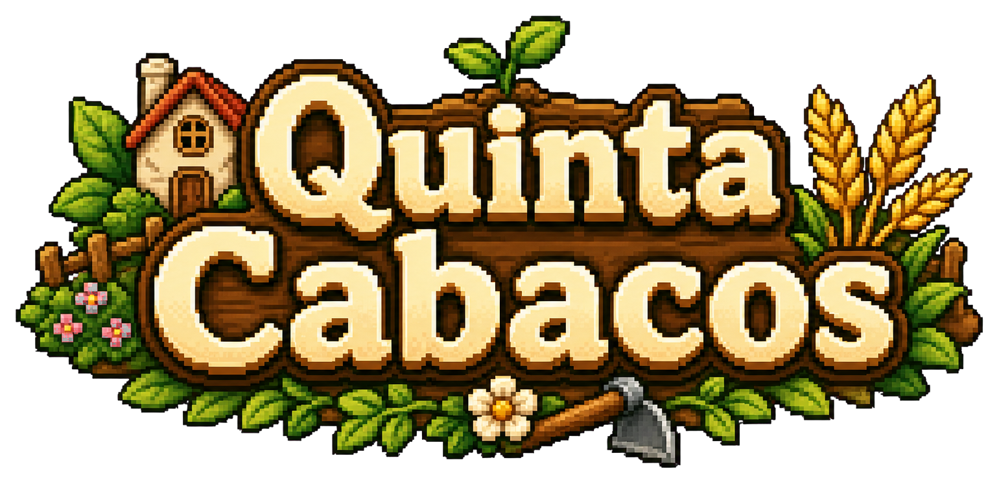
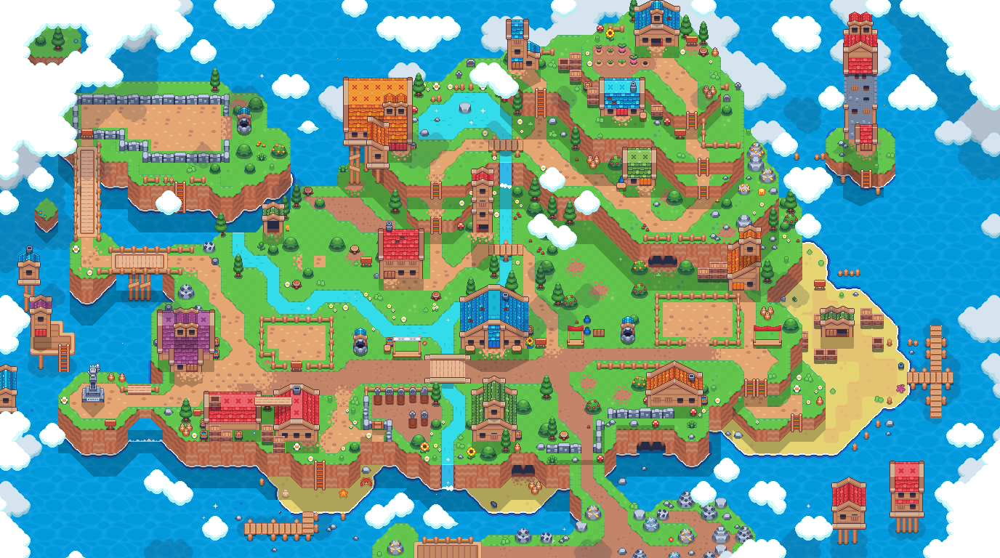
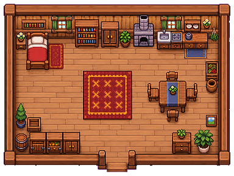
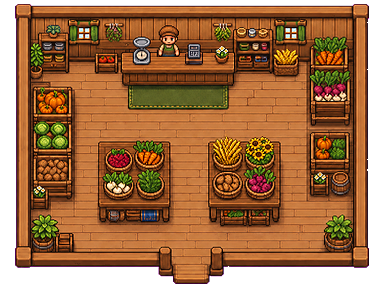
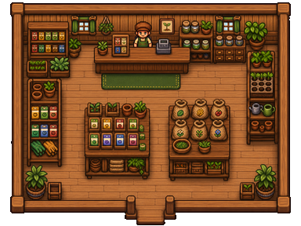
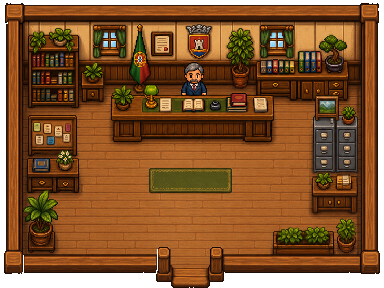

# Quinta Cabacos

<p align="center">
  
</p>

**Quinta Cabacos** e um jogo 2D top-down em pixel art desenvolvido em **Phaser 3**, **TypeScript** e **Vite**. O jogador gere uma pequena quinta, compra sementes e ferramentas, cultiva plantas, vende colheitas, compra novos terrenos e completa quests para ganhar dinheiro.

O projeto foi desenvolvido para a unidade curricular de Tecnologias Multimedia 2025/2026, com uma estrutura simples, modular e facil de apresentar.

## Grupo

| Elemento | Numero de aluno | GitHub |
|---|---|---|
| Cristiano Fonseca | 29725  | [m1guelfonseca](https://github.com/m1guelfonseca) |
| Goncalo Sousa | 29726 | [goncalojbsousa](https://github.com/goncalojbsousa) |

> Antes da entrega final no Moodle, preencher os numeros de aluno e criar a tag `1.0` no commit entregue.

## Tecnologias

| Tecnologia | Uso |
|---|---|
| **Phaser 3.90.0** | Motor 2D do jogo, incluido via npm |
| **TypeScript** | Codigo principal do jogo, com tipagem para facilitar manutencao |
| **Vite 6.3.1** | Servidor local e build do projeto |
| **Tiled** | Criacao do mapa principal, interiores, colisoes e zonas de interacao |
| **HTML/CSS** | Estrutura base da pagina onde o jogo corre |

## Descricao do Jogo

O jogo segue uma logica de **farm simulator** em 2D. O objetivo e evoluir a quinta atraves de ciclos de cultivo e economia:

- comprar sementes na loja;
- preparar terreno com a enxada;
- plantar e regar culturas;
- esperar pelo crescimento ao longo dos dias;
- colher e vender no mercado;
- comprar ferramentas e novos terrenos;
- ativar e completar quests no Crop Market.

O estado do jogo e apresentado no HUD: dinheiro, dia/hora, energia, agua do regador, inventario/hotbar e quest ativa.

## Regras e Sistemas Implementados

### Cultivo

- O jogador so pode plantar em terreno preparado.
- A enxada prepara o solo.
- As sementes ocupam slots do inventario/hotbar.
- As plantas precisam de agua para crescer.
- Cada cultura tem tempos de crescimento proprios.
- Quando a cultura esta pronta, aparece um indicador visual e pode ser colhida com a foice.

### Energia, tempo e desmaio

- Usar ferramentas, plantar, colher e regar consome energia.
- O dia avanca com o tempo de jogo.
- Se o jogador ficar ativo ate as 02:00, desmaia.
- Ao desmaiar, perde parte do dinheiro, recupera energia parcialmente e volta para a quinta de manha.
- Dormir em casa avanca para o dia seguinte e recupera energia.

### Economia

- O jogador comeca com dinheiro inicial.
- Sementes e ferramentas podem ser compradas nas lojas.
- Colheitas podem ser vendidas no Crop Market.
- Terrenos extra podem ser comprados na camara municipal.

### Quests

As quests sao ativadas na tab **Quests** do Crop Market. Apenas uma quest pode estar ativa de cada vez.

Quests atuais:

| Quest | Objetivo | Recompensa |
|---|---|---|
| Plantar Aboboras | Plantar 3 aboboras | 75 $ |
| Vender Cenouras | Vender 3 cenouras no Crop Market | 60 $ |
| Regar Plantas | Regar qualquer tipo de planta 10 vezes | 50 $ |

Quando uma quest fica completa, o jogador deve voltar ao Crop Market e clicar em **Concluir** para receber a recompensa.

### Inventario e save

- Hotbar com 8 slots.
- Inventario extra com drag and drop entre slots.
- Sistema de save em 3 slots.
- O save guarda inventario, dinheiro, tempo, energia, agua do regador, terrenos comprados, plantas/solo e progresso das quests.

## Controlos

| Tecla / Acao | Funcao |
|---|---|
| `W`, `A`, `S`, `D` | Mover o jogador |
| Setas direcionais | Mover o jogador |
| `E` | Interagir com edificios, lojas, cama, mercado, poco e saidas |
| `I` | Abrir ou fechar o inventario |
| `ESC` | Abrir menu de pausa ou fechar paineis |
| `1` a `8` | Selecionar slot da hotbar |
| Clique esquerdo | Usar item selecionado no terreno |
| Arrastar com o rato | Mover itens entre inventario e hotbar |

## Imagens do Projeto

### Mapa Principal



### Interiores dos Edificios

<table>
  <tr>
    <td align="center">
      <strong>Casa do jogador</strong><br>
      
    </td>
    <td align="center">
      <strong>Mercado de colheitas</strong><br>
      
    </td>
  </tr>
  <tr>
    <td align="center">
      <strong>Loja de sementes</strong><br>
      
    </td>
    <td align="center">
      <strong>Camara municipal</strong><br>
      
    </td>
  </tr>
</table>

## Aspectos Multimedia

O projeto usa recursos multimedia adequados ao estilo pixel art e ao carregamento no browser:

| Tipo | Formato | Uso |
|---|---|---|
| Imagens | `.png` | Tilesets, interiores, UI, logo, ferramentas, culturas e jogador |
| Mapas | `.tmj` | Mapas criados/editados no Tiled |
| Sons | `.mp3` | Efeitos de interacao, compra, venda, ferramentas, rega, sono e feedback de erro |
| Spritesheets | `.png` | Animacoes do jogador, ferramentas/culturas por frames e barra de energia |

Resumo dos assets em `public/assets`:

- 47 ficheiros `.png`, cerca de 5.53 MB.
- 17 ficheiros `.mp3`, cerca de 0.31 MB.
- 6 ficheiros `.tmj`, cerca de 0.37 MB.
- Total aproximado: 6.21 MB.

Os mapas e interiores foram compostos no Tiled a partir dos tilesets incluidos no projeto. Os sprites e elementos de UI foram integrados em tamanhos proporcionais ao uso no jogo, evitando imagens demasiado grandes para elementos pequenos. Os sons estao em MP3 comprimido, em ficheiros curtos, para manter o carregamento leve.

## Suporte Multilingue

O jogo suporta **portugues** e **ingles**. O idioma pode ser alterado nas definicoes.

A estrutura de traducao esta centralizada em:

```text
src/game/services/LanguageService.ts
```

Isto evita strings duplicadas espalhadas pelo codigo e permite traduzir menus, HUD, lojas, quests, itens e mensagens de feedback.

## Estrutura do Projeto

| Pasta / Ficheiro | Descricao |
|---|---|
| `index.html` | Pagina base onde o jogo e montado |
| `src/main.ts` | Entrada da aplicacao |
| `src/game/main.ts` | Configuracao principal do Phaser e registo das scenes |
| `src/game/scenes` | Menus, jogo principal, interiores, lojas e pausa |
| `src/game/world` | Criacao do mapa principal e camara |
| `src/game/objects` | Objetos principais, como o jogador |
| `src/game/systems` | Sistemas de gameplay: cultivo, entradas, regador |
| `src/game/services` | Estado e servicos: dinheiro, inventario, tempo, saves, quests, idioma |
| `src/game/ui` | HUD, inventario, lojas, paineis e displays |
| `src/game/data` | Dados dos itens, sementes, ferramentas e culturas |
| `public/assets` | Imagens, audio, tilesets, tilemaps e UI |
| `docs` | Documentacao auxiliar |

## Como Executar

Instalar dependencias:

```bash
npm install
```

Executar em modo desenvolvimento:

```bash
npm run dev
```

Ou sem logs do template Phaser:

```bash
npm run dev-nolog
```

O jogo fica disponivel em:

```text
http://localhost:8080
```

Gerar build de producao:

```bash
npm run build
```

Build sem logs do template:

```bash
npm run build-nolog
```

## Repositorio e Entrega

- O projeto Phaser esta na raiz do repositorio.
- O projeto usa `.gitignore` para evitar versionar dependencias como `node_modules`.
- Para a entrega final, criar a tag:

```bash
git tag 1.0
git push origin 1.0
```

O ficheiro a entregar no Moodle deve incluir:

- URL do repositorio GitHub;
- commit hash da versao entregue;
- nome e numero de cada elemento.

## Checklist do Enunciado

| Requisito | Estado |
|---|---|
| Phaser 3 no browser | Implementado com Phaser 3.90.0 via npm |
| Projeto na raiz do repositorio | Sim |
| Grupo de 2 alunos | Sim, falta preencher numeros |
| Suporte a 2 linguas | Portugues e ingles |
| Pelo menos 1 som | Varios efeitos MP3 integrados |
| Input claro | Teclado, rato, hotbar e drag and drop |
| Estado de jogo visivel | Dinheiro, tempo, energia, agua, inventario e quests |
| Interacoes/colisoes | Arcade Physics, tilemaps, zonas de interacao e colisao |
| README completo | Atualizado segundo a secao 4.3 do enunciado |
| Tag 1.0 | A criar na versao final |

## Notas Conhecidas

- A scene `GameOver` existe e esta registada, mas o ciclo principal atual usa o sistema de desmaio como penalizacao de fim de dia.
- Os numeros de aluno devem ser adicionados antes da entrega final.
- Caso sejam usados packs externos de arte/som, os respetivos creditos devem ser confirmados na apresentacao.
