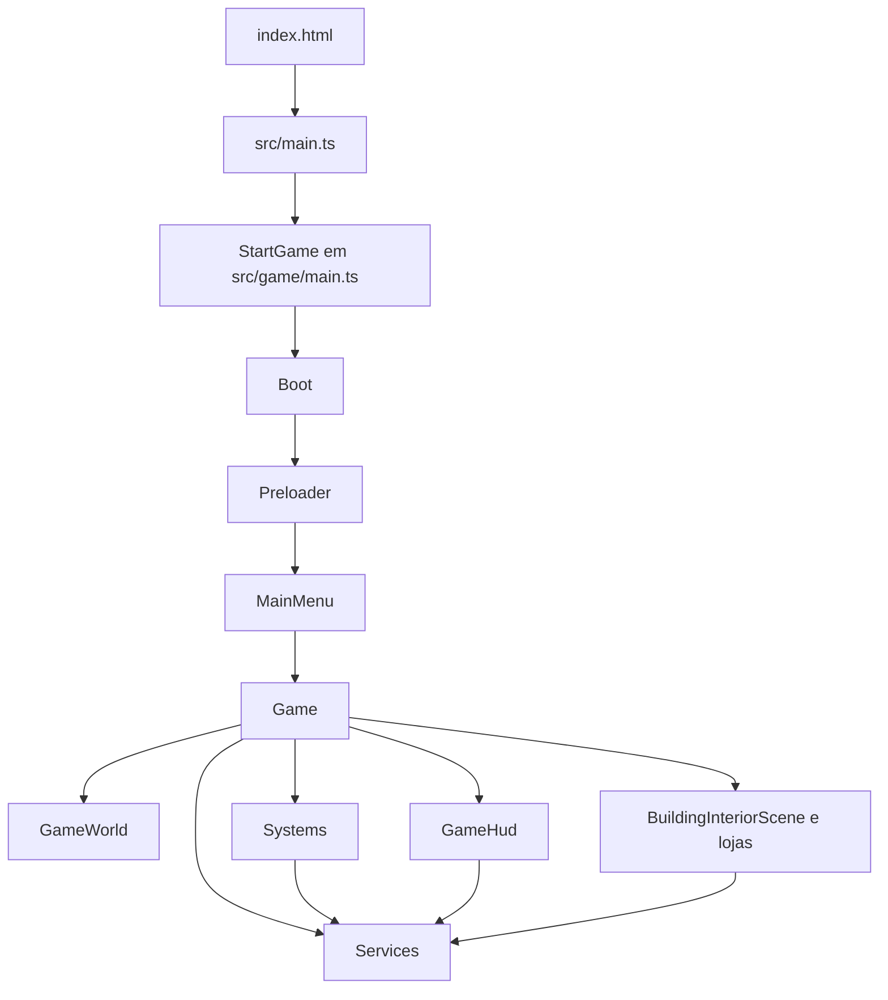

# Relatorio completo do projeto Quinta Cabacos

Este relatorio explica o projeto ficheiro a ficheiro, com foco em como o codigo esta organizado, como os sistemas comunicam entre si e como o jogo funciona internamente.

O projeto e um jogo 2D top-down de simulacao agricola feito com Phaser 3, TypeScript e Vite. O jogador controla uma personagem numa quinta, compra sementes e ferramentas, prepara terra, planta, rega, colhe, vende produtos, compra novos terrenos, completa quests e guarda/carrega o progresso.

## 1. Visao geral da arquitetura

O jogo esta dividido em camadas simples:

- `index.html` cria a pagina do browser.
- `src/main.ts` arranca a aplicacao quando o DOM esta pronto.
- `src/game/main.ts` configura o Phaser e regista todas as scenes.
- `src/game/scenes` contem menus, jogo principal e interiores.
- `src/game/world` cria o mapa principal, camadas e colisoes.
- `src/game/objects` contem objetos fisicos como o jogador.
- `src/game/input` centraliza teclado e rato.
- `src/game/systems` contem sistemas de gameplay: farming, entrada em edificios e regador.
- `src/game/services` guarda estado do jogo: dinheiro, inventario, tempo, energia, quests, terrenos, idioma e saves.
- `src/game/ui` desenha HUD, inventario, botoes, paineis e menus.
- `src/game/data` contem os dados dos itens e culturas.
- `public/assets` contem imagens, sons, tilemaps e sprites.

Fluxo principal:



## 2. Como os sistemas comunicam

A scene `Game` e o centro que cria e liga quase tudo. Ela instancia:

- `InventoryService`
- `MoneyService`
- `TimeService`
- `EnergyService`
- `WateringCanService`
- `LandOwnershipService`
- `QuestService`
- `GameWorld`
- `GameHud`
- `FarmingSystem`
- `BuildingEntranceSystem`
- `WateringCanSystem`

Os services guardam estado. Os sistemas alteram esse estado. A UI apresenta esse estado.

Exemplo: quando o jogador planta uma semente:

1. `GameInput` detecta clique do rato.
2. `FarmingSystem.update()` verifica o tile selecionado.
3. `FarmingSystem` consulta o item selecionado no `InventoryService`.
4. Se for uma semente e a terra estiver preparada, remove uma unidade do inventario.
5. Cria a imagem da planta no mapa.
6. Gasta energia atraves do `EnergyService`.
7. Atualiza quests atraves do `QuestService`.
8. Chama `hud.refresh()` para atualizar o ecra.
9. Toca som com `playSound()`.

Exemplo: quando o jogador entra numa loja:

1. `BuildingEntranceSystem` verifica se o jogador esta dentro da zona de uma porta.
2. Mostra `InteractionPrompt`.
3. Ao premir `E`, faz `scene.sleep('Game')`.
4. Lanca a scene interior, por exemplo `SeedShop`.
5. Passa para essa scene os mesmos services de inventario, dinheiro, tempo, energia, terrenos e quests.
6. A loja altera esses mesmos services.
7. Ao sair, a scene interior fecha e acorda a scene `Game`.

Isto e importante: as scenes interiores nao criam um novo inventario nem novo dinheiro. Elas recebem referencias para os services ja existentes. Por isso o estado continua igual quando se entra e sai de edificios.

## 3. Ficheiros da raiz

### `package.json`

Define metadados, scripts e dependencias do projeto.

- Nome do pacote: `quinta-cabacos`.
- Descricao: jogo 2D top-down em pixel art.
- Scripts:
  - `npm run dev`: executa `log.js dev` e arranca Vite com `vite/config.dev.mjs`.
  - `npm run build`: executa `log.js build` e gera build de producao com `vite/config.prod.mjs`.
  - `npm run dev-nolog`: arranca Vite sem o script de log.
  - `npm run build-nolog`: build sem o script de log.
- Dependencias:
  - `phaser`: motor do jogo.
  - `terser`: minificacao do build.
- Dev dependencies:
  - `typescript`
  - `vite`

### `package-lock.json`

Ficheiro gerado pelo npm. Guarda as versoes exatas das dependencias instaladas para garantir que o projeto e instalado de forma igual noutras maquinas.

### `index.html`

Pagina base do jogo.

Cria:

- `<div id="app">`
- `<div id="game-container">`

Depois importa o modulo:

```ts
/src/main.ts
```

O Phaser usa o elemento `game-container` como parent para criar o canvas do jogo.

### `public/style.css`

Define o layout global da pagina:

- remove margens e padding;
- ocupa 100% da largura e altura;
- bloqueia scroll com `overflow: hidden`;
- faz o canvas ocupar todo o ecra;
- usa `image-rendering: pixelated` para manter o aspeto pixel art.

### `tsconfig.json`

Configuracao TypeScript.

Pontos importantes:

- `target: ES2020`
- `module: ESNext`
- `moduleResolution: bundler`
- `strict: true`
- `noEmit: true`, porque quem faz o build e o Vite
- inclui apenas a pasta `src`

Isto obriga o codigo a ter tipagem mais segura e evita varios erros comuns.

### `vite/config.dev.mjs`

Configuracao Vite para desenvolvimento.

- `base: './'`
- servidor na porta `8080`
- separa Phaser num chunk proprio chamado `phaser`

### `vite/config.prod.mjs`

Configuracao Vite para producao.

Tem o mesmo `base` e porta, mas tambem:

- `logLevel: 'warning'`
- minificacao com `terser`
- `compress.passes: 2`
- `mangle: true`
- remove comentarios no output
- plugin `phasermsg()` para imprimir mensagens durante o build

### `log.js`

Script Node usado nos scripts `dev` e `build`.

Le o `package.json`, descobre a versao do Phaser e envia um pedido HTTPS para `gryzor.co`. Se falhar, termina com erro silencioso. Este ficheiro nao faz parte da logica do jogo; e um script auxiliar vindo do template Phaser.

### `README.md`

Documentacao principal do projeto.

Explica:

- conceito do jogo;
- grupo;
- tecnologias;
- regras de cultivo;
- energia, tempo e desmaio;
- economia;
- quests;
- inventario;
- save;
- controlos;
- imagens;
- assets;
- suporte multilingue;
- estrutura do projeto;
- como executar.

### `LICENSE`

Licenca MIT do projeto. Define permissao para usar, copiar, modificar e distribuir o software, mantendo o aviso de copyright e a licenca.

### `screenshot.png`

Imagem demonstrativa do projeto. Serve como recurso visual fora do jogo.

### `vite-dev*.log`

Ficheiros de log vazios ou auxiliares criados durante execucoes do servidor Vite. Nao fazem parte da logica do jogo.

## 4. Entrada da aplicacao

### `src/main.ts`

E o ponto de entrada TypeScript.

Importa `StartGame` de `src/game/main.ts` e espera pelo evento `DOMContentLoaded`. Quando a pagina esta pronta, chama:

```ts
StartGame('game-container');
```

Isto garante que o Phaser so tenta montar o canvas quando o elemento HTML ja existe.

### `src/game/main.ts`

Configura e arranca o Phaser.

Define:

- renderer automatico (`AUTO`);
- tamanho inicial igual a `window.innerWidth` e `window.innerHeight`;
- parent `game-container`;
- `pixelArt: true`;
- Arcade Physics sem gravidade;
- escala responsiva com `Scale.RESIZE`;
- lista de scenes.

Scenes registadas:

1. `Boot`
2. `Preloader`
3. `MainMenu`
4. `SettingsMenu`
5. `PauseMenu`
6. `Game`
7. `HouseInterior`
8. `CropMarket`
9. `SeedShop`
10. `ToolShop`
11. `TownHall`
12. `GameOver`

Exporta a funcao `StartGame(parent)`, que cria uma nova instancia de `Phaser.Game`.

### `src/vite-env.d.ts`

Ficheiro de tipos gerado/esperado pelo Vite. Adiciona referencias aos tipos `vite/client`, permitindo que o TypeScript reconheca funcionalidades do ambiente Vite.

## 5. Dados do jogo

### `src/game/data/ItemData.ts`

Centraliza todos os itens, ferramentas, sementes e colheitas.

Define tipos:

- `ItemId`
- `CropId`
- `CropStage`
- `GameItem`
- `SeedItem`
- `ToolItem`
- `HarvestItem`

Ferramentas:

- axe
- hoe
- rod
- sickle
- shovel
- sword
- wateringCan

Cada ferramenta tem:

- `id`
- `nameKey` para traducao
- caminho do asset
- preco
- stack maximo 1

Culturas:

- beetroot
- cabbage
- carrot
- cauliflower
- kale
- parsnip
- potato
- pumpkin
- radish
- sunflower
- wheat

Cada cultura define:

- tamanho dos frames da spritesheet;
- nome da semente;
- nome da colheita;
- preco de compra;
- preco de venda;
- dias de rega necessarios por fase.

O ficheiro gera automaticamente:

- itens de semente (`carrotSeed`, `pumpkinSeed`, etc.);
- itens de colheita (`carrotHarvest`, `pumpkinHarvest`, etc.);
- lista `gameItems`.

Funcoes exportadas:

- `getItemById(itemId)`: devolve um item.
- `getSeedItems()`: devolve sementes para a loja.
- `getToolShopItems()`: devolve ferramentas para a loja.
- `getHarvestItems()`: devolve colheitas vendaveis.

Tambem define os itens iniciais:

- ferramentas: `sickle`, `hoe`
- sementes: `carrotSeed`, `pumpkinSeed`

Este ficheiro e uma das melhores partes para apresentar: para adicionar uma nova cultura, basta acrescentar dados aqui e colocar a imagem correspondente nos assets.

## 6. Services: estado e regras globais

### `src/game/services/InventoryService.ts`

Guarda o inventario.

O inventario tem:

- 8 slots de hotbar;
- 16 slots extra;
- total de 24 slots.

Cada slot tem:

- `itemId`
- `quantity`

Responsabilidades:

- selecionar slot ativo;
- adicionar item;
- verificar se tem item;
- remover item;
- mover/empilhar slots;
- criar snapshot para save;
- carregar snapshot;
- avisar a UI quando muda.

O metodo `onChange(callback)` permite que o HUD se atualize automaticamente quando o inventario muda.

### `src/game/services/MoneyService.ts`

Guarda e altera o dinheiro do jogador.

Metodos:

- `getBalance()`
- `canAfford(amount)`
- `spend(amount)`
- `earn(amount)`
- `setBalance(balance)`
- `onChange(callback)`

E usado pelas lojas, mercado, quests e save.

### `src/game/services/TimeService.ts`

Controla dia e hora.

Configuracoes internas:

- um dia de jogo dura `130000` ms;
- o jogador desmaia as `02:00`;
- a manha comeca as `07:00`.

Metodos principais:

- `update(time)`: avanca o relogio com base no tempo real do Phaser.
- `advanceDay()`: avanca dia manualmente.
- `isFaintTime()`: verifica se chegou a hora de desmaio.
- `startNextDay()`: usado ao dormir.
- `setMorningTime()`: volta para 07:00.
- `getSnapshot()` e `loadSnapshot()`.

### `src/game/services/EnergyService.ts`

Controla energia.

Valores:

- energia maxima: 100
- energia apos desmaio: 25

Metodos:

- `getEnergy()`
- `getMaxEnergy()`
- `setEnergy()`
- `hasEnergy()`
- `spend()`
- `restoreAfterSleep()`
- `restoreAfterFaint()`

O farming usa energia para preparar terra, plantar, regar e colher.

### `src/game/services/WateringCanService.ts`

Controla agua no regador.

Valor maximo:

- 3 cargas de agua

Metodos:

- `getWater()`
- `getMaxWater()`
- `setWater()`
- `fill()`
- `useWater()`

E usado pelo `WateringCanSystem` para encher no poco e pelo `FarmingSystem` para regar plantas.

### `src/game/services/LandOwnershipService.ts`

Controla terrenos comprados.

Tipos de terreno:

- `farm`: terreno inicial;
- `farm2`: terreno extra;
- `farm3`: terreno extra.

`farmPurchaseOptions` define:

- terreno;
- nome traduzivel;
- preco.

Metodos:

- `isFarmOwned(farmId)`
- `buyFarm(farmId)`
- `getSnapshot()`
- `loadSnapshot(farmIds)`

O `GameWorld` usa este service para decidir que camadas de farming estao disponiveis e que colisoes devem ser removidas.

### `src/game/services/QuestService.ts`

Controla quests.

Quests implementadas:

- `plantPumpkins`: plantar 3 aboboras, recompensa 75.
- `sellCarrots`: vender 3 cenouras, recompensa 60.
- `waterPlants`: regar 10 plantas, recompensa 50.

Cada quest tem:

- id;
- titulo traduzivel;
- descricao traduzivel;
- icone;
- objetivo;
- recompensa.

Metodos importantes:

- `activateQuest()`
- `plantCrop(cropId)`
- `sellCrop(cropId)`
- `waterPlant()`
- `claimReward()`
- `getQuest()`
- `getQuests()`
- `getActiveQuests()`
- `hasActiveQuest()`
- `getSnapshot()`
- `loadSnapshot()`
- `onChange()`

O sistema permite apenas uma quest ativa de cada vez.

### `src/game/services/SaveService.ts`

Guarda e carrega o jogo usando `localStorage`.

Slots:

- `slot1`
- `slot2`
- `slot3`

O save guarda:

- versao;
- data;
- posicao do jogador;
- inventario;
- tempo;
- dinheiro;
- energia;
- agua do regador;
- terrenos comprados;
- estado do farming;
- quests.

Metodos estaticos:

- `getCurrentSlot()`
- `setCurrentSlot(slotId)`
- `saveCurrentSlot(save)`
- `save(slotId, save)`
- `load(slotId)`
- `getSlotInfo(slotId)`

### `src/game/services/LanguageService.ts`

Sistema de traducoes.

Idiomas:

- `pt`
- `en`

Guarda o idioma em `localStorage` com a chave:

```text
farming-simulator-cabacos-language
```

Funcoes:

- `getCurrentLanguage()`
- `setCurrentLanguage(language)`
- `translate(key)`
- `getAvailableLanguages()`
- `getLanguageLabel(language)`

As traducoes incluem menus, lojas, HUD, quests, itens e mensagens.

### `src/game/services/SoundService.ts`

Centraliza sons.

Define o tipo `SoundKey`, com chaves como:

- `buyLand`
- `doorOpen`
- `fail`
- `faint`
- `getWater`
- `hoe`
- `plantSeed`
- `purchaseClick`
- `select`
- `sell`
- `sickle`
- `sleep`
- `toolSwap`
- `waterPlants`

Exporta:

```ts
playSound(scene, key, volume = 0.5, rate = 1)
```

Isto evita repetir `scene.sound.play(...)` em todo o codigo.

## 7. Input, jogador e mundo

### `src/game/input/GameInput.ts`

Centraliza input do teclado e rato.

Controlos:

- setas e WASD para movimento;
- `I` para inventario;
- `E` para interagir;
- `ESC` para pausa/fechar;
- `N` para avancar dia;
- `1` a `8` para hotbar;
- rato para usar item e drag-and-drop.

Tambem calcula:

- `mousePressed`
- `mouseReleased`

Isto transforma input continuo em eventos de clique mais faceis de usar pelos sistemas.

### `src/game/objects/Player.ts`

Cria e atualiza o jogador.

Usa um `Phaser.Physics.Arcade.Sprite` com:

- sprite inicial `idle`;
- velocidade 80;
- corpo fisico pequeno para colisoes;
- animacoes `idle` e `walk`.

No `update(input)`:

- calcula movimento horizontal e vertical;
- normaliza o vetor para nao andar mais rapido na diagonal;
- altera velocidade;
- vira sprite para a esquerda/direita;
- toca animacao correta;
- toca som de passos com pequena variacao de pitch.

### `src/game/world/GameWorld.ts`

Cria o mapa principal e o mundo fisico.

Responsabilidades:

- carregar tilemap `tilemap`;
- adicionar tilesets;
- criar camadas visuais;
- ignorar camadas de colisao durante criacao visual;
- aplicar profundidade baseada em propriedades do Tiled;
- identificar camadas de quinta: `farm`, `farm2`, `farm3`;
- identificar placas de compra: `buy_farm2`, `buy_farm3`;
- criar layer `Collision`;
- criar jogador;
- adicionar colisao jogador/mundo;
- criar colisoes opcionais para terrenos ainda nao comprados;
- configurar camera com zoom 2;
- seguir jogador.

Metodos importantes:

- `getAvailableFarmLayers()`: devolve apenas as camadas onde o jogador pode plantar.
- `applyLandOwnership()`: esconde placas e remove colisoes quando terreno e comprado.
- `movePlayerToSpawn()`
- `movePlayerToPosition(x, y)`

Este ficheiro liga diretamente o mapa Tiled aos sistemas de gameplay.

## 8. Sistemas de gameplay

### `src/game/systems/FarmingSystem.ts`

Sistema mais importante do gameplay agricola.

Controla:

- terra preparada;
- plantas;
- crescimento;
- rega;
- colheita;
- indicadores visuais;
- save/load do estado agricola.

Custos de energia:

- preparar terra: 2
- plantar: 1
- colher: 2
- regar: 1

Estados internos:

- `tilledTiles`: mapa de tiles preparados.
- `plantedTiles`: conjunto de tiles ocupados.
- `crops`: lista de plantas.
- `tileHighlight`: destaque branco do tile utilizavel.

No `update(input, currentDay)`:

1. limpa terra preparada expirada;
2. faz crescer plantas se tiverem regas suficientes;
3. atualiza indicadores de agua/colheita;
4. descobre tile sob o rato;
5. se houve clique, usa o item selecionado;
6. desenha highlight se o item pode ser usado.

Ferramentas:

- `hoe`: prepara terra.
- `sickle`: colhe planta pronta.
- `wateringCan`: rega planta.
- sementes: plantam em terra preparada.

Save:

- guarda layer, tile X/Y, dia em que a terra foi preparada;
- guarda planta, fase, dias regados e ultimo dia regado.

### `src/game/systems/BuildingEntranceSystem.ts`

Controla entradas nos edificios do mapa principal.

Le a layer `Interactions` do mapa e procura objetos:

- `player_house_door`
- `player_crop_market_door`
- `player_seed_shop_door`
- `player_tool_shop_door`
- `player_town_hall_door`

Para cada objeto cria uma zona retangular.

No update:

- verifica se o jogador esta dentro de uma zona;
- mostra prompt traduzido;
- ao premir `E`, toca som de porta;
- faz `sleep` da scene `Game`;
- lanca a scene interior correta;
- passa os services partilhados para essa scene.

### `src/game/systems/WateringCanSystem.ts`

Controla o enchimento do regador nos pocos.

Le objetos da layer `Interactions` que tenham propriedade:

```text
action = fill_watering_can
```

Mostra prompt apenas quando:

- jogador tem regador selecionado;
- jogador esta perto de um poco.

Ao premir `E`:

- enche o regador;
- atualiza texto de agua;
- toca som `getWater` se nao estava cheio.

Tambem mostra o texto de agua por cima do slot da hotbar onde esta o regador.

## 9. Scenes

### `src/game/scenes/Boot.ts`

Primeira scene.

Carrega apenas o background do menu principal:

```ts
mainMenuBackground
```

Depois inicia `Preloader`.

### `src/game/scenes/Preloader.ts`

Carrega todos os assets necessarios para o jogo.

Durante o carregamento:

- mostra background;
- mostra barra de progresso.

Carrega:

- logo;
- UI;
- icones;
- spritesheets de energia;
- slots do inventario;
- ferramentas;
- spritesheets de culturas;
- tilemaps;
- imagens de interiores;
- tilesets;
- solo;
- sons;
- spritesheets do jogador.

No `create()`:

- cria frame `trimmed` do botao;
- cria animacao `idle`;
- cria animacao `walk`;
- inicia `MainMenu`.

### `src/game/scenes/MainMenu.ts`

Menu inicial.

Mostra:

- background;
- logo;
- botao comecar;
- botao definicoes;
- menu de escolha de slot.

Ao carregar num slot:

- usa `SaveService.load(slotId)`;
- define slot atual;
- inicia `Game` com ou sem save.

### `src/game/scenes/SettingsMenu.ts`

Menu de definicoes.

Permite alterar idioma entre portugues e ingles.

Pode ser aberto:

- a partir do menu principal;
- a partir do menu de pausa.

Ao alterar idioma:

- chama `setCurrentLanguage(language)`;
- reinicia a propria scene para atualizar textos.

### `src/game/scenes/PauseMenu.ts`

Menu de pausa.

Exporta tambem a funcao:

```ts
openPauseMenu(scene)
```

Essa funcao:

- lanca `PauseMenu`;
- poe por cima;
- pausa a scene atual.

Botoes:

- continuar;
- guardar;
- carregar;
- definicoes.

Guardar:

- procura a scene `Game`;
- chama `createSaveGame()`;
- usa `SaveService.saveCurrentSlot(save)`.

Carregar:

- usa `SaveService.load(slotId)`;
- reinicia `Game` com o save escolhido.

### `src/game/scenes/Game.ts`

Scene principal do jogo.

E o centro da aplicacao.

No `create()`:

1. cria `LandOwnershipService`;
2. carrega terrenos guardados;
3. cria `GameWorld`;
4. cria `GameInput`;
5. cria inventario, dinheiro, tempo, energia, regador e quests;
6. carrega save se existir;
7. cria overlay de noite;
8. cria HUD;
9. cria sistema de entradas em edificios;
10. cria sistema do regador;
11. cria camera da UI;
12. cria fade;
13. cria `FarmingSystem`;
14. carrega posicao guardada do jogador;
15. regista eventos de resize e wake.

No `update(time)`:

- atualiza input;
- abre pausa com `ESC`;
- ignora gameplay durante transicao de desmaio;
- permite avancar dia com `N`;
- atualiza tempo;
- atualiza escuridao noturna;
- se chegou as 02:00, inicia desmaio;
- atualiza jogador;
- atualiza farming;
- atualiza HUD;
- atualiza regador;
- atualiza entradas de edificios.

`createSaveGame()` agrega todos os snapshots para guardar.

Desmaio:

- perde 25% do dinheiro;
- energia fica a 25;
- hora volta para 07:00;
- jogador volta ao spawn;
- UI atualiza.

### `src/game/scenes/BuildingInteriorScene.ts`

Classe base para interiores.

Evita duplicacao entre casa, mercado, lojas e camara.

Recebe configuracao:

- sceneKey;
- mapKey;
- imageKey;
- exitObjectName.

Recebe tambem os services vindos da scene `Game`.

No `create()`:

- cria tilemap interior;
- mostra imagem de fundo;
- define bounds fisicos;
- cria jogador;
- cria paredes invisiveis a partir da layer `Collision`;
- cria camera UI;
- cria zona de saida;
- cria prompt de saida;
- cria HUD;
- cria fade;
- centra camera.

No `update()`:

- atualiza input;
- abre pausa com `ESC` quando nao ha painel aberto;
- atualiza tempo;
- verifica desmaio;
- atualiza jogador e HUD;
- mostra prompt de saida;
- ao premir `E`, fecha interior e acorda `Game`.

Tambem fornece metodos utilitarios para scenes filhas:

- `getInteractionZone()`
- `getOptionalInteractionZone()`
- `createPrompt()`
- `isPlayerInside()`
- `setActivePanel()`
- `updatePanelInteraction()`

### `src/game/scenes/HouseInterior.ts`

Interior da casa.

Extende `BuildingInteriorScene`.

Adiciona:

- zona da cama `player_house_bed`;
- prompt de dormir.

Ao premir `E` junto a cama:

- toca som `sleep`;
- faz fade;
- chama `gameTime.startNextDay()`;
- chama `energy.restoreAfterSleep()`;
- atualiza HUD.

### `src/game/scenes/CropMarket.ts`

Interior do mercado.

Adiciona:

- zona `crop_market`;
- prompt de vender colheitas;
- `CropMarketPanel`.

O painel permite:

- vender colheitas;
- ativar quests;
- concluir quests.

### `src/game/scenes/SeedShop.ts`

Interior da loja de sementes.

Adiciona:

- zona `seed_shop`;
- prompt de comprar sementes;
- `SeedShopPanel`.

O painel compra sementes usando `InventoryService` e `MoneyService`.

### `src/game/scenes/ToolShop.ts`

Interior da loja de ferramentas.

Adiciona:

- zona `tool_shop`;
- prompt de comprar ferramentas;
- `ToolShopPanel`.

Impede comprar uma ferramenta que o jogador ja tem.

### `src/game/scenes/TownHall.ts`

Interior da camara municipal.

Adiciona:

- zona opcional `town_hall_buy_farms`;
- prompt de comprar terrenos;
- `FarmPurchasePanel`.

Ao comprar terreno, atualiza `LandOwnershipService`. Quando a scene principal acorda, `GameWorld.applyLandOwnership()` atualiza placas e colisoes.

### `src/game/scenes/GameOver.ts`

Scene simples de fim de jogo.

Mostra:

- fundo vermelho;
- background do menu com transparencia;
- texto `Game Over`.

Ao clicar, volta ao `MainMenu`.

No estado atual, esta scene esta registada mas nao parece ser usada no fluxo principal de desmaio, porque o desmaio apenas penaliza e volta a manha.

## 10. UI e HUD

### `src/game/ui/GameHud.ts`

Agrupa a interface principal.

Cria:

- `InventoryUi`
- `MoneyDisplay`
- `TimeDisplay`
- `EnergyDisplay`
- `QuestDisplay`

Liga callbacks:

- quando inventario muda, refresca inventario;
- quando dinheiro muda, refresca dinheiro;
- quando quests mudam, refresca quests.

Exposicoes importantes:

- `update(input)`
- `refresh()`
- `layout()`
- `isPointerOverInventory(x, y)`

### `src/game/ui/InventoryUi.ts`

Controla hotbar e inventario.

Funcionalidades:

- mostra 8 slots de hotbar;
- mostra 16 slots extra quando inventario esta aberto;
- abre/fecha com `I`;
- seleciona hotbar com `1` a `8`;
- permite drag-and-drop entre slots;
- mostra tooltip com nome traduzido do item;
- evita que cliques na UI sejam tratados como cliques no mapa.

Comunica com:

- `InventoryService`;
- `GameInput`;
- `InventorySlotView`;
- `InventoryTooltip`;
- `MenuPanel`.

### `src/game/ui/InventorySlotView.ts`

Representa visualmente um slot.

Mostra:

- fundo do slot;
- seletor da hotbar;
- imagem do item;
- quantidade.

Metodo principal:

- `refresh(slot, isSelected)`

### `src/game/ui/InventoryTooltip.ts`

Pequena label junto ao rato quando o jogador passa por cima de um item.

Calcula posicao com `PhaserMath.Clamp` para nao sair fora do ecra.

### `src/game/ui/MoneyDisplay.ts`

Mostra dinheiro.

Usa:

- painel 9-slice;
- icone de moeda;
- label traduzida;
- valor atual do `MoneyService`.

### `src/game/ui/TimeDisplay.ts`

Mostra dia e hora.

Usa `TimeService`.

Formata hora com dois digitos:

```text
07:00
```

### `src/game/ui/EnergyDisplay.ts`

Mostra energia.

Usa spritesheet `energyBar` e escolhe frame com base na percentagem de energia.

Mostra tambem:

- label traduzida;
- energia atual/maxima.

### `src/game/ui/QuestDisplay.ts`

Mostra a quest ativa no HUD.

Se uma quest estiver pronta para concluir, da prioridade a essa quest.

Mostra:

- icone;
- estado;
- titulo;
- progresso;
- recompensa.

Fica invisivel se nao houver quest ativa.

### `src/game/ui/MenuPanel.ts`

Componente generico para menus.

Cria:

- frame com 9-slice;
- placa de titulo;
- botao de fechar opcional.

Metodos:

- `addContent()`
- `open()`
- `close()`
- `toggle()`
- `isOpen()`
- `containsPoint()`
- `center()`

### `src/game/ui/TextButton.ts`

Funcao para criar botoes de texto.

Cria:

- background 9-slice;
- texto;
- area interativa;
- tint no hover;
- som no clique;
- callback `onClick`.

Devolve um `Container` com propriedade extra `label`.

### `src/game/ui/PixelNineSlice.ts`

Helper para criar imagens 9-slice com escala pixel art.

Recebe:

- scene;
- textura;
- largura;
- altura;
- escala;
- tamanho do slice;
- frame opcional.

E usado por paineis, botoes e componentes de loja.

### `src/game/ui/InteractionPrompt.ts`

Prompt de interacao, por exemplo:

- `E - Entrar em casa`
- `E - Comprar sementes`
- `E - Dormir`

Tem:

- fundo 9-slice;
- texto;
- `show()`;
- `hide()`;
- `setText()`.

A largura do fundo ajusta ao texto.

### `src/game/ui/ScreenFade.ts`

Cria retangulo preto para transicoes.

Metodos:

- `play(onFadeInComplete, onFadeOutComplete)`
- `fadeIn()`
- `fadeOut()`
- `showBlack()`
- `layout()`

Usado em sono e desmaio.

### `src/game/ui/LoadGameMenu.ts`

Menu reutilizavel para escolher slots.

Usado no menu principal e no menu de pausa.

Mostra tres slots:

- vazio;
- ou `Dia X HH:MM` se houver save.

Usa:

- `SaveService.getSlotInfo()`;
- `createTextButton()`;
- `MenuPanel`.

### `src/game/ui/SeedShopPanel.ts`

Painel da loja de sementes.

Lista todas as sementes vindas de `getSeedItems()`.

Ao comprar:

1. verifica dinheiro;
2. tenta adicionar ao inventario;
3. gasta dinheiro;
4. toca som;
5. atualiza HUD;
6. mostra mensagem.

### `src/game/ui/ToolShopPanel.ts`

Painel da loja de ferramentas.

Lista ferramentas vindas de `getToolShopItems()`.

Ao comprar:

1. verifica se o jogador ja tem a ferramenta;
2. verifica dinheiro;
3. tenta adicionar ao inventario;
4. gasta dinheiro;
5. toca som;
6. atualiza HUD;
7. mostra mensagem.

### `src/game/ui/CropMarketPanel.ts`

Painel do mercado.

Tem duas tabs:

- `sell`: vender colheitas;
- `quests`: gerir quests.

Na tab de venda:

- lista `getHarvestItems()`;
- cada linha vende uma colheita;
- remove item do inventario;
- adiciona dinheiro;
- informa `QuestService.sellCrop(cropId)`.

Na tab de quests:

- mostra cada quest;
- permite ativar;
- mostra progresso;
- permite reclamar recompensa quando pronta.

Este painel comunica com:

- `InventoryService`;
- `MoneyService`;
- `QuestService`;
- `GameHud` atraves de callback.

### `src/game/ui/FarmPurchasePanel.ts`

Painel de compra de terrenos.

Lista `farmPurchaseOptions`.

Ao comprar:

1. verifica se ja e dono;
2. verifica dinheiro;
3. gasta dinheiro;
4. chama `landOwnership.buyFarm()`;
5. toca som;
6. atualiza HUD;
7. atualiza linhas.

### `src/game/ui/ShopRow.ts`

Linha reutilizavel para lojas e mercado.

Mostra:

- fundo;
- icone;
- nome;
- moeda;
- preco;
- botao.

E usado por:

- `SeedShopPanel`;
- `ToolShopPanel`;
- `CropMarketPanel`.

## 11. Documentacao auxiliar

### `docs/translations.md`

Documento curto que explica como usar o sistema de traducoes.

Indica que as traducoes vivem em:

```text
src/game/services/LanguageService.ts
```

E mostra como usar:

```ts
translate('startGame')
```

## 12. Assets e mapas

### `public/favicon.png`

Icone do site/jogo no browser.

### `public/assets/mainmenu/logo_quinta_cabacos.png`

Logo mostrado no menu principal e no README.

### `public/assets/mainmenu/main_menu_background.png`

Imagem de fundo do menu principal e do preloader.

### `public/assets/characters/player/idle/base_waiting_strip9.png`

Spritesheet da animacao parada do jogador.

Carregada no `Preloader` com:

- frame width: 96
- frame height: 64
- frames 0 a 8
- frame rate 9

### `public/assets/characters/player/walk/base_walk_strip8.png`

Spritesheet da animacao de andar.

Carregada com:

- frame width: 96
- frame height: 64
- frames 0 a 7
- frame rate 8

### `public/assets/tools/*.png`

Imagens das ferramentas:

- axe
- hoe
- rod
- shovel
- sickle
- sword
- watering_can

Sao usadas no inventario, hotbar e loja de ferramentas.

### `public/assets/plantation/crops/*.png`

Spritesheets das culturas:

- beetroot
- cabbage
- carrot
- cauliflower
- kale
- parsnip
- potato
- pumpkin
- radish
- sunflower
- wheat

Cada spritesheet contem frames de semente/crescimento/colheita. Os tamanhos dos frames sao definidos em `ItemData.ts`.

### `public/assets/plantation/soil.png`

Imagem colocada sobre um tile quando o jogador prepara a terra com a enxada.

### `public/assets/farming/indicators/crop_need_water.png`

Indicador mostrado sobre uma planta quando ela precisa de agua nesse dia.

### `public/assets/farming/indicators/ready_to_collect.png`

Indicador mostrado quando a planta chegou a fase final e pode ser colhida.

### `public/assets/inventory/inventorySlot.png`

Spritesheet/Imagem dos slots do inventario.

### `public/assets/inventory/hotbar_selector.png`

Imagem do seletor do slot ativo da hotbar.

### `public/assets/inventory/InventoryRect.png`

Asset de inventario presente no projeto, mas no codigo atual a UI usa principalmente `inventorySlot`, `hotbarSelector` e `MenuPanel`.

### `public/assets/ui/common/*.png`

Assets de interface:

- `9slice_menu_brown.png`
- `9slice_menu_brown_darker.png`
- `9slice_menu_white.png`
- `button.png`

Usados por `PixelNineSlice`, `MenuPanel`, `TextButton`, lojas e paineis.

### `public/assets/ui/hud/*.png`

Icones e elementos do HUD:

- `coin.png`
- `energyBar.png`
- `land.png`
- `light.png`
- `sun.png`

### `public/assets/ui/shop/icon_bg.png`

Fundo dos icones nas linhas das lojas e quests.

### `public/assets/sounds/*.mp3`

Efeitos sonoros:

- `buyLand`: compra de terreno;
- `doorOpen`: entrada/saida de edificio;
- `fail`: erro;
- `faint`: desmaio;
- `getWater`: encher regador;
- `grassyStep`: passos;
- `hoe`: enxada;
- `interaction`: asset presente, mas nao aparece carregado no `Preloader` atual;
- `openMenu`: abrir menu;
- `plantSeed`: plantar;
- `purchaseClick`: compra/recompensa;
- `select`: selecionar;
- `sell`: vender;
- `sickle`: colher;
- `sleep`: dormir;
- `toolSwap`: trocar ferramenta/slot;
- `waterPlants`: regar.

### `public/assets/tilemap/Cabacos_map.tmj`

Mapa principal criado no Tiled.

Dimensoes:

- 86 x 48 tiles;
- tiles de 16 x 16 px.

Layers principais:

- mar, terra, caminhos, sombras, decoracao, edificios;
- `farm`, `farm2`, `farm3`;
- `Collision`;
- `buy_farm2_collision`, `buy_farm3_collision`;
- `buy_farm2`, `buy_farm3`;
- `Interactions`.

Objetos de interacao:

- porta da casa;
- porta do mercado;
- porta da loja de sementes;
- porta da loja de ferramentas;
- porta da camara;
- pocos.

### `public/assets/tilemap/Casa_player.tmj`

Mapa interior da casa.

Tem:

- imagem de fundo;
- layer `Collision`;
- layer `Interactions`.

Interacoes:

- saida da casa;
- cama.

### `public/assets/tilemap/Crop_market.tmj`

Mapa interior do mercado.

Interacoes:

- saida;
- zona `crop_market` para abrir painel de venda/quests.

### `public/assets/tilemap/Seed_shop.tmj`

Mapa interior da loja de sementes.

Interacoes:

- saida;
- zona `seed_shop`.

### `public/assets/tilemap/tool_shop.tmj`

Mapa interior da loja de ferramentas.

Interacoes:

- zona `tool_shop`;
- saida.

### `public/assets/tilemap/Town_hall.tmj`

Mapa interior da camara municipal.

Interacoes:

- saida;
- zona `town_hall_buy_farms`.

### `public/assets/tilemap/*_sem_fundo.png` e imagens de interiores

Imagens usadas como fundo visual dos interiores:

- casa;
- mercado;
- loja de sementes;
- loja de ferramentas;
- camara municipal.

### `public/assets/tilemap/ts_map.png` e `ts_forest.png`

Tilesets usados pelo mapa principal.

### `public/assets/docs/readme_map_preview.png`

Imagem de preview do mapa usada no README.

## 13. Ciclos principais de jogo

### Ciclo de arranque

1. Browser abre `index.html`.
2. `src/main.ts` chama `StartGame`.
3. Phaser inicia `Boot`.
4. `Boot` carrega background e chama `Preloader`.
5. `Preloader` carrega assets e cria animacoes.
6. Inicia `MainMenu`.
7. Jogador escolhe slot.
8. `Game` comeca novo jogo ou carrega save.

### Ciclo de farming

1. Jogador seleciona ferramenta/semente na hotbar.
2. Move-se perto de um tile de quinta.
3. Clica no tile.
4. `FarmingSystem` valida item, tile, energia e estado.
5. Aplica acao:
   - enxada prepara;
   - semente planta;
   - regador rega;
   - foice colhe.
6. Atualiza inventario, energia, quests, sons e HUD.

### Ciclo de lojas

1. Jogador entra num edificio.
2. Scene interior recebe os services partilhados.
3. Jogador abre painel com `E`.
4. Painel altera dinheiro/inventario/terrenos/quests.
5. HUD atualiza.
6. Ao sair, a scene `Game` acorda com o estado atualizado.

### Ciclo de save

1. Jogador pausa.
2. Clica guardar.
3. `PauseMenu` pede a `Game` um objeto `SaveGameData`.
4. `Game.createSaveGame()` agrega snapshots.
5. `SaveService` grava JSON no `localStorage`.
6. Ao carregar, `Game` recebe o save e repoe os services e farming.

## 14. Pontos fortes para apresentar

- Separacao clara entre scenes, services, systems e UI.
- Estado centralizado em services.
- UI reage a mudancas por callbacks `onChange`.
- Save bem estruturado com snapshots.
- Tilemaps do Tiled controlam colisoes e interacoes.
- Sistema de farming com crescimento por dias regados.
- Quests integradas com acoes reais do jogador.
- Suporte multilingue centralizado.
- Componentes de UI reutilizaveis, como `MenuPanel`, `TextButton`, `ShopRow`.
- Interiores reutilizam `BuildingInteriorScene`, evitando duplicacao.

## 15. Observacoes tecnicas uteis para defesa

- O jogo usa Arcade Physics, adequado para um top-down 2D simples.
- A camera principal segue o jogador no mundo.
- Uma segunda camera e usada para UI, separando HUD do mapa.
- `localStorage` e suficiente para save local no browser.
- O estado do jogo nao depende de backend.
- Os assets sao carregados uma vez no `Preloader`, depois usados por chave.
- O Tiled e usado nao so para desenhar mapas, mas tambem para definir colisoes e zonas de interacao.

## 16. Roteiro rapido para apresentacao oral

1. "O projeto e um farming simulator 2D em Phaser, TypeScript e Vite."
2. "A entrada e `index.html`, depois `src/main.ts`, depois `src/game/main.ts`, onde registamos as scenes."
3. "A scene principal e `Game`, que cria mundo, jogador, input, services, sistemas e HUD."
4. "Os services guardam estado: inventario, dinheiro, tempo, energia, terrenos, quests e save."
5. "Os sistemas executam gameplay: farming, entradas em edificios e regador."
6. "A UI apenas mostra e permite interagir com esse estado."
7. "Os mapas do Tiled definem camadas, colisoes e zonas de interacao."
8. "As lojas e interiores recebem os mesmos services, por isso o estado e partilhado."
9. "O save junta snapshots de todos os sistemas e guarda em localStorage."
10. "O projeto esta modular: para adicionar culturas, quests ou lojas, ha pontos bem definidos."

